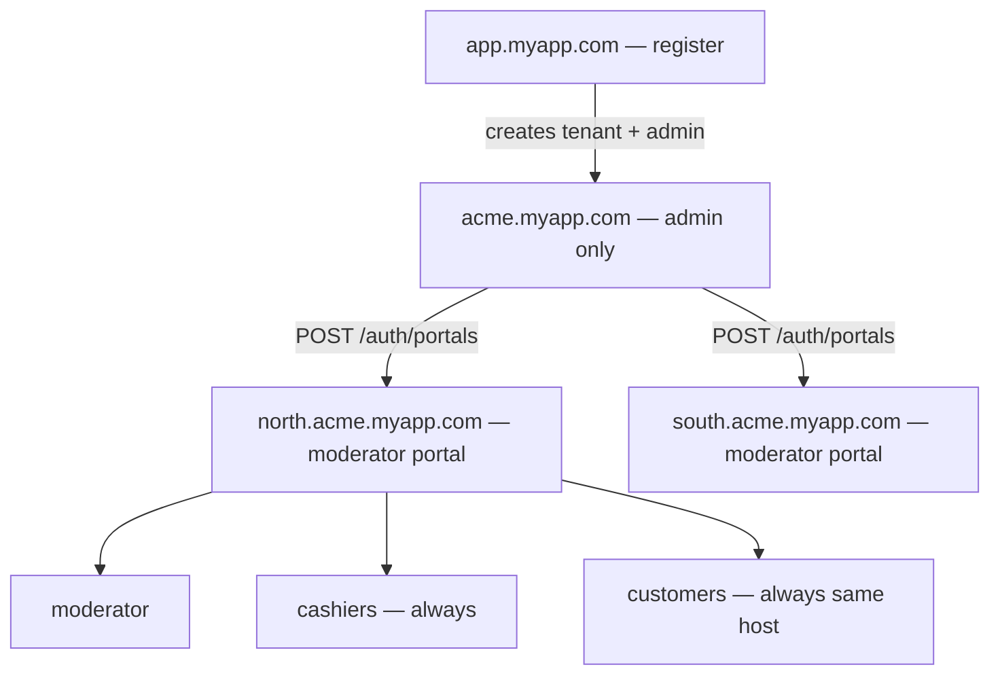
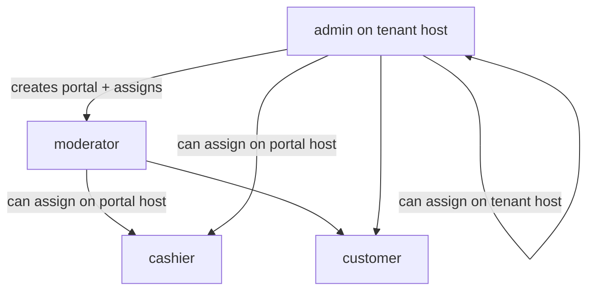
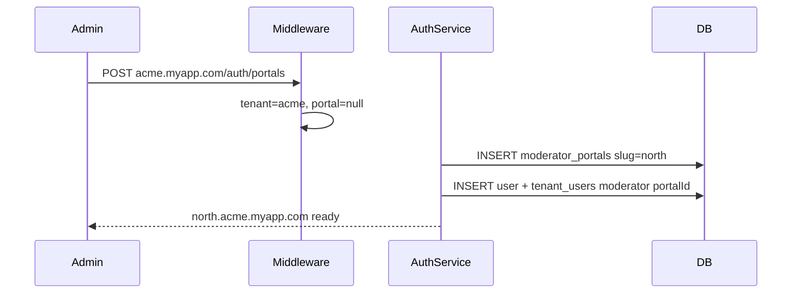
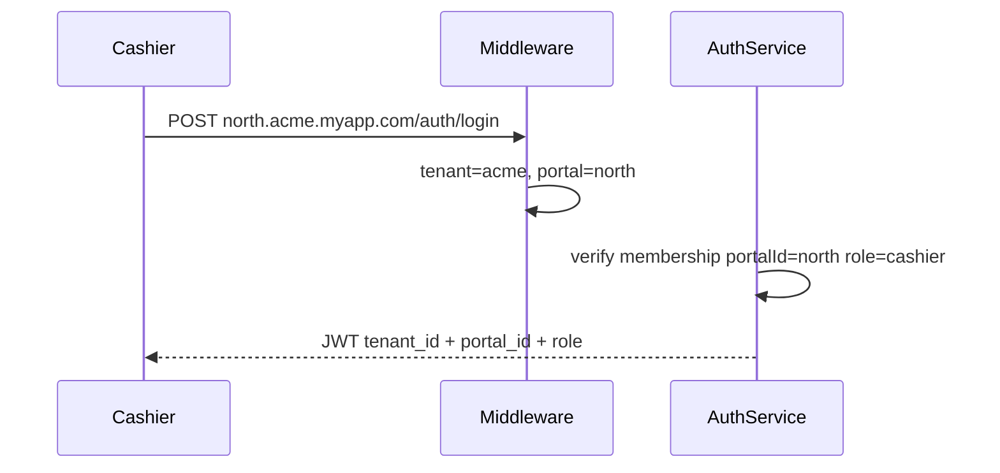
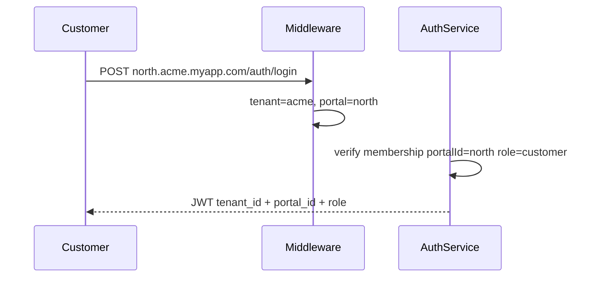

# Tenant Roles and RBAC (Hierarchical Subdomains)

## Core design (confirmed)

1. **Admin owns the tenant subdomain** — register creates `acme.myapp.com` and assigns the first user as `admin`.
2. **Admin generates subdomains under their domain for moderators** — `POST /auth/portals` creates `{slug}.acme.myapp.com` and binds one moderator to that portal.
3. **Cashiers always live under a moderator subdomain** — invited and log in only on `{portal}.{tenant}.BASE_DOMAIN`.
4. **Customers always use the same moderator subdomain as cashiers** — never on tenant root. A portal must exist before customers can be invited.

### Routing rules (simplified)

| Role | Login host |
|------|------------|
| admin | `acme.myapp.com` (tenant root) |
| moderator | `north.acme.myapp.com` (their portal) |
| cashier | `north.acme.myapp.com` (same portal — always) |
| customer | `north.acme.myapp.com` (same portal as cashier — always) |

Cashiers and customers are always scoped to a specific `portalId`. They share the moderator portal host — there is no separate cashier subdomain.

## Domain model

The **admin** owns the company’s primary subdomain. The admin **provisions nested subdomains** for moderators. **Cashiers and customers always share the moderator portal subdomain** — the same host, scoped by role in JWT.



### Subdomain hierarchy

| Level | Example host | Who |
|-------|--------------|-----|
| Platform | `app.myapp.com` | Public register |
| Tenant (admin) | `acme.myapp.com` | **admin** manages company + creates portals |
| Moderator portal | `north.acme.myapp.com` | **moderator**, **cashier**, **customer** |
| Custom domain (optional) | `north.acme.com` | Same roles when tenant uses custom domain |

### Role placement rules

| Role | Login host | Notes |
|------|------------|-------|
| **admin** | `{tenant}.BASE_DOMAIN` | Creates moderator portals; can invite co-admins on tenant host |
| **moderator** | `{portal}.{tenant}.BASE_DOMAIN` | One portal per provisioned subdomain; assigned at portal creation |
| **cashier** | moderator portal only | Required `portalId`; same host as customers |
| **customer** | moderator portal only | Required `portalId`; always same subdomain as cashiers — never tenant root |

### Assignment hierarchy



- **admin** creates portals (`POST /auth/portals`) and may assign any role
- **moderator** on their portal may assign **cashier** and **customer** only
- **cashier** / **customer** cannot invite or change roles

## Current state

Roles are free-form strings on [`tenant_users.role`](src/tenant-user/entities/tenant-user.entity.ts). Registration hardcodes `'admin'`. No portal concept exists. [`TenantGuard`](src/auth/guards/tenant.guard.ts) does not resolve nested subdomains.

## Data model changes

### `tenants` (existing + optional custom domain)

Add to [`tenant.entity.ts`](src/tenant/entities/tenant.entity.ts):

- `customDomain` (`varchar`, nullable, unique) — e.g. `acme.com`

### New `moderator_portals` table

```ts
@Entity('moderator_portals')
class ModeratorPortal {
  id: uuid
  tenantId: uuid          // FK → tenants
  slug: string            // e.g. "north" → north.acme.myapp.com
  status: 'active' | 'suspended'
  createdAt: Date
  // UNIQUE (tenantId, slug)
}
```

### `tenant_users` (extend)

Add optional portal scope:

```ts
@Column({ nullable: true })
portalId: string | null   // FK → moderator_portals

@Column({ type: 'enum', enum: TenantRole, default: TenantRole.Customer })
role: TenantRole
```

| role | portalId |
|------|----------|
| admin | `null` |
| moderator | required — the portal they own |
| cashier | required — assigned portal |
| customer | required — same portal as cashiers on that subdomain |

JWT payload adds optional `portal_id` alongside `tenant_id` and `role`.

## Host resolution

**Config:** `BASE_DOMAIN=myapp.com`

**Parser** ([`tenant-host.util.ts`](src/common/utils/tenant-host.util.ts)):

| Host | Result |
|------|--------|
| `app.myapp.com` | platform (no tenant) |
| `acme.myapp.com` | `{ tenant: acme, portal: null }` |
| `north.acme.myapp.com` | `{ tenant: acme, portal: north }` |
| `acme.com` | lookup tenant by `customDomain` → `{ tenant, portal: null }` |
| `north.acme.com` | lookup tenant by custom domain + portal slug (if custom domain configured) |

**[`TenantContextMiddleware`](src/tenant/middleware/tenant-context.middleware.ts)** sets:

- `req.tenant`
- `req.portal` (null on tenant root)

## Guards

| Guard | Purpose |
|-------|---------|
| `RequireTenantGuard` | Must resolve a tenant from Host |
| `RequirePortalGuard` | Must resolve a moderator portal (portal-scoped routes) |
| `TenantGuard` | Valid JWT; `tenant_id` matches `req.tenant`; `portal_id` matches `req.portal` (or both null on admin host) |
| `PortalRoleGuard` | Role allowed **for this host** (see matrix below) |
| `RolesGuard` | `@Roles(...)` metadata check |

**Login role × host matrix:**

| Host type | Allowed roles |
|-----------|---------------|
| Tenant root (`acme.myapp.com`) | `admin` only |
| Moderator portal (`north.acme.myapp.com`) | `moderator`, `cashier`, `customer` |

Reject login with `403` if role does not match the host type.

## API endpoints

| Method | Path | Host | Guards | Actor | Purpose |
|--------|------|------|--------|-------|---------|
| `POST` | `/auth/register` | platform | none | public | Create tenant + admin |
| `POST` | `/auth/login` | tenant or portal | `RequireTenantGuard` | public | Email + password; host determines context |
| `POST` | `/auth/portals` | tenant root | `TenantGuard`, `RolesGuard` | admin | **Create moderator subdomain** + assign moderator |
| `GET` | `/auth/portals` | tenant root | `TenantGuard`, `RolesGuard` | admin | List portals for tenant |
| `POST` | `/auth/members` | tenant root | `TenantGuard`, `RolesGuard` | admin | Add co-admin |
| `POST` | `/auth/members` | portal host | `RequirePortalGuard`, `TenantGuard`, `RolesGuard` | admin, moderator | Add cashier/customer to this portal |
| `PATCH` | `/auth/members/:userId/role` | tenant or portal | guards + role check | admin, moderator | Change role (portal-scoped) |

### Create moderator portal — `POST /auth/portals`

Admin on `acme.myapp.com`:

```json
{
  "slug": "north",
  "moderatorEmail": "mod@acme.com",
  "moderatorPassword": "password123"
}
```

Flow:

1. Validate slug unique within tenant
2. Create `moderator_portals` row → host becomes `north.acme.myapp.com`
3. Create user (if new) + `tenant_users` row: `role: moderator`, `portalId: portal.id`
4. Return `{ portal: { id, slug, host }, moderator: { id, email } }`

Moderator then logs in at `north.acme.myapp.com/auth/login` and invites cashiers and customers there (both use the same portal host).

### DTOs

- `CreatePortalDto`: `slug`, `moderatorEmail`, `moderatorPassword`
- `LoginDto`: `email`, `password`
- `AddMemberDto`: `email`, `password`, `role`
- `UpdateMemberRoleDto`: `role`

## Request flows

**Admin creates moderator portal:**



**Cashier login (always on portal):**



**Customer login (same portal host as cashier):**



## Shared enum and helpers

[`src/common/enums/tenant-role.enum.ts`](src/common/enums/tenant-role.enum.ts):

```ts
export enum TenantRole {
  Admin = 'admin',
  Moderator = 'moderator',
  Cashier = 'cashier',
  Customer = 'customer',
}
```

[`src/common/utils/role.util.ts`](src/common/utils/role.util.ts):

- `canAssignRole(actor, target)`
- `rolesAllowedOnHost(hostType: 'tenant' | 'portal')` — tenant root: admin only; portal: moderator, cashier, customer

## Files touched (summary)

| Action | File |
|--------|------|
| Create | `src/common/enums/tenant-role.enum.ts` |
| Create | `src/common/utils/role.util.ts`, `tenant-host.util.ts` |
| Create | `src/moderator-portal/entities/moderator-portal.entity.ts` |
| Create | `src/moderator-portal/moderator-portal.service.ts`, `moderator-portal.module.ts` |
| Create | `src/tenant/middleware/tenant-context.middleware.ts` |
| Create | `src/tenant/guards/require-tenant.guard.ts`, `require-portal.guard.ts` |
| Create | `src/auth/guards/portal-role.guard.ts`, `roles.guard.ts` |
| Create | DTOs: `create-portal.dto.ts`, `login.dto.ts`, `add-member.dto.ts`, `update-member-role.dto.ts` |
| Create | migrations: roles enum + `moderator_portals` + `tenant_users.portalId` |
| Create | `src/AuthApp/CreatePortal.yml`, `Login.yml`, `AddMember.yml` |
| Modify | `tenant.entity.ts`, `tenant-user.entity.ts`, `tenant.service.ts`, `auth.service.ts`, `auth.controller.ts`, `auth.module.ts`, `tenant.guard.ts`, `main.ts`, `Test.yml` |

## Out of scope (future)

- DNS/CNAME automation for custom domains
- Email invite tokens
- Moderator self-service portal slug change
- Per-permission granularity beyond role names
