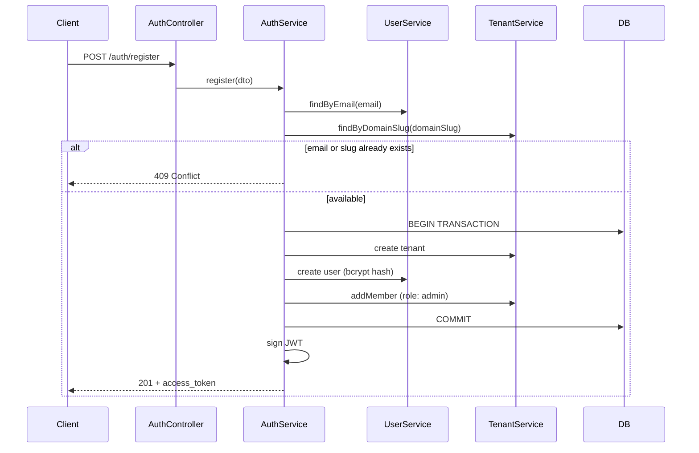

# Registration

Workspace signup for AuthApp. A single request creates a new user, a new tenant (workspace), and links them with the `admin` role. The caller receives a JWT immediately — no separate login step required after signup.

---

## Feature overview

### What it does

Registration is the **onboarding entry point** for new organizations. It supports the multi-tenant model described in [Architecture.md](./Architecture.md):

- A **user** is created with a hashed password (bcrypt).
- A **tenant** (workspace) is created with a unique `domainSlug`.
- A **tenant_users** row links the user to the tenant as `admin` (first user owns the workspace).

All three writes run inside a **single database transaction**. If any step fails, nothing is persisted.

### When to use it

| Use case | Register? |
|----------|-----------|
| New company signing up for the first time | Yes |
| User joining an existing workspace | No — use invite/join flow (not implemented yet) |
| Existing user creating another workspace | No — use a separate “create workspace” flow (not implemented yet) |

### High-level flow



### Security notes

- Passwords are never stored in plain text; only a bcrypt hash is saved.
- Password hash is never returned in API responses.
- JWT payload includes `sub` (user id), `email`, `tenant_id`, and `role` for downstream `TenantGuard` checks.
- Duplicate emails and workspace slugs are rejected before the transaction starts.

---

## Endpoint

### `POST /auth/register`

Create a new user and workspace in one request.

| | |
|---|---|
| **URL** | `/auth/register` |
| **Method** | `POST` |
| **Auth** | None (public) |
| **Content-Type** | `application/json` |

---

### Request body

| Field | Type | Required | Constraints | Description |
|-------|------|----------|-------------|-------------|
| `email` | `string` | Yes | Valid email | User login identity (globally unique) |
| `password` | `string` | Yes | 8–72 characters | Plain-text password (hashed server-side) |
| `tenantName` | `string` | Yes | 2–100 characters | Display name of the workspace |
| `domainSlug` | `string` | Yes | 2–100 chars, `^[a-z0-9]+(?:-[a-z0-9]+)*$` | Unique workspace identifier (e.g. `acme` for `acme.myapp.com`) |

#### Example request

```json
{
  "email": "jane@acme.com",
  "password": "password123",
  "tenantName": "Acme Corp",
  "domainSlug": "acme"
}
```

#### Validation errors — `400 Bad Request`

Returned when the body fails `class-validator` checks (invalid email, short password, invalid slug, etc.).

```json
{
  "statusCode": 400,
  "message": [
    "password must be longer than or equal to 8 characters",
    "domainSlug must be lowercase letters, numbers, and hyphens"
  ],
  "error": "Bad Request"
}
```

---

### Success response — `201 Created`

Wrapped in the standard API envelope (`res.created`).

```json
{
  "success": true,
  "message": "Registration successful",
  "data": {
    "access_token": "eyJhbGciOiJIUzI1NiIsInR5cCI6IkpXVCJ9...",
    "user": {
      "id": "550e8400-e29b-41d4-a716-446655440000",
      "email": "jane@acme.com"
    },
    "tenant": {
      "id": "6ba7b810-9dad-11d1-80b4-00c04fd430c8",
      "name": "Acme Corp",
      "domainSlug": "acme"
    },
    "role": "admin"
  }
}
```

#### Response fields (`data`)

| Field | Type | Description |
|-------|------|-------------|
| `access_token` | `string` | JWT valid for 1 day; use as `Authorization: Bearer <token>` |
| `user.id` | `uuid` | Created user id (`sub` in JWT) |
| `user.email` | `string` | Registered email |
| `tenant.id` | `uuid` | Created tenant id (`tenant_id` in JWT) |
| `tenant.name` | `string` | Workspace display name |
| `tenant.domainSlug` | `string` | Unique workspace slug |
| `role` | `string` | Always `admin` for the registering user |

#### JWT payload (decoded)

```json
{
  "sub": "550e8400-e29b-41d4-a716-446655440000",
  "email": "jane@acme.com",
  "tenant_id": "6ba7b810-9dad-11d1-80b4-00c04fd430c8",
  "role": "admin",
  "iat": 1718912345,
  "exp": 1718998745
}
```

---

### Error responses

#### `409 Conflict` — email already registered

```json
{
  "statusCode": 409,
  "message": "Email is already registered",
  "error": "Conflict"
}
```

#### `409 Conflict` — workspace slug taken

```json
{
  "statusCode": 409,
  "message": "Workspace slug is already taken",
  "error": "Conflict"
}
```

#### `500 Internal Server Error`

Unexpected failure (e.g. database unavailable). Transaction is rolled back automatically.

---

## Database impact

On success, three rows are created:

```
tenants          → 1 row (name, domainSlug, status: active)
users            → 1 row (email, passwordHash)
tenant_users     → 1 row (tenantId, userId, role: admin)
```

---

## Example usage

### cURL

```bash
curl -X POST http://localhost:3000/auth/register \
  -H "Content-Type: application/json" \
  -d '{
    "email": "jane@acme.com",
    "password": "password123",
    "tenantName": "Acme Corp",
    "domainSlug": "acme"
  }'
```

### Bruno / OpenCollection

See `src/AuthApp/Register.yml` in the API collection.

---

## Related code

| File | Responsibility |
|------|----------------|
| `src/auth/auth.controller.ts` | HTTP route `POST /auth/register` |
| `src/auth/auth.service.ts` | Orchestration, transaction, JWT issuance |
| `src/auth/dto/register.dto.ts` | Request validation rules |
| `src/user/user.service.ts` | User lookup and creation (bcrypt) |
| `src/tenant/tenant.service.ts` | Tenant lookup, creation, membership |
| `src/common/utils/res.util.ts` | Standard `{ success, message, data }` envelope |

---

## Related docs

- [Architecture.md](./Architecture.md) — multi-tenant data model and auth strategy
