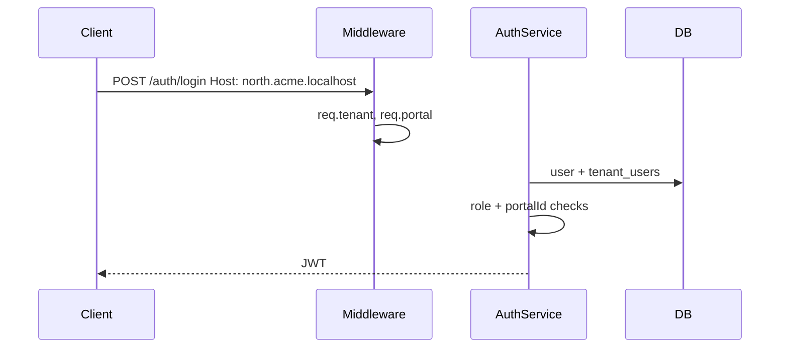

# Login — design

Host-scoped authentication. The **`Host` header** determines tenant and portal context; the client sends only **email** and **password**.

See also: [Roles & subdomains](../roles-and-subdomains/Design.md) · [Endpoints](./Endpoints.md)

---

## What it does

1. `TenantContextMiddleware` resolves `req.tenant` and `req.portal` from `Host`.
2. Verifies email + bcrypt password.
3. Loads `tenant_users` membership for that tenant.
4. Ensures role is allowed on this host type.
5. Ensures `membership.portalId` matches the resolved portal (if any).
6. Returns JWT with role and portal from the database — never from the request body.

---

## Role × host rules

| Host | Allowed roles |
|------|---------------|
| Tenant root (`acme.localhost`) | `admin` only |
| Portal (`north.acme.localhost`) | `moderator`, `cashier`, `customer` |

Login on the wrong host returns `403 Forbidden`.

---

## Flow

---

## Related code

| File | Role |
|------|------|
| `src/auth/auth.controller.ts` | `POST /auth/login` |
| `src/auth/auth.service.ts` | `login()` |
| `src/auth/dto/auth.dto.ts` | `LoginDto` |
| `src/user/user.service.ts` | `verifyPassword()` |
