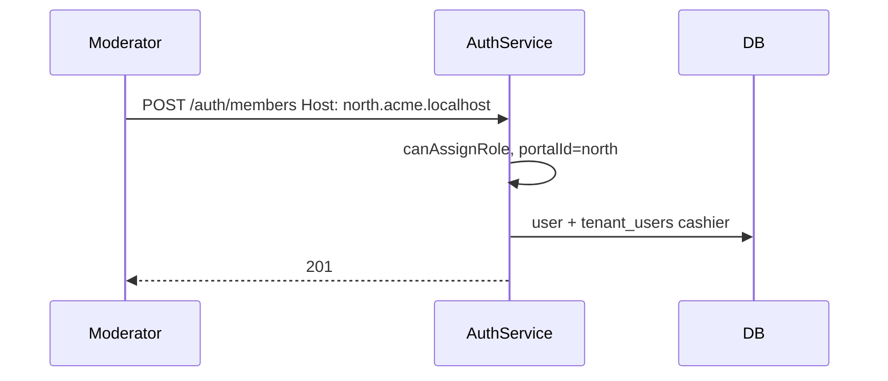

# Members — design

Invite users to a tenant and update their roles. Behavior depends on **host** and **actor role**.

See also: [Roles & subdomains](../roles-and-subdomains/Design.md) · [Endpoints](./Endpoints.md)

---

## What it does

### Add member — `POST /auth/members`

| Host | Who can call | Roles that can be assigned |
|------|--------------|----------------------------|
| Tenant root | admin | `admin` only |
| Portal host | admin, moderator | `cashier`, `customer` (moderator); admin can also assign cashier/customer |

- **Cashier** and **customer** always get `portalId` from the current portal host.
- **Admin** always has `portalId: null`.
- New users require `password`; existing global users can be linked without it.

### Update role — `PATCH /auth/members/:userId/role`

Same host and actor rules. Cannot demote the **last admin** in a tenant.

---

## Assignment matrix

| Actor | Can assign |
|-------|------------|
| admin | any role (subject to host rules above) |
| moderator | `cashier`, `customer` on their portal |
| cashier / customer | none |

---

## Admin cross-portal access

Admin JWT has `portal_id: null`. Admins may call portal-host APIs (e.g. add cashier on `north.acme.localhost`) using their tenant-root token — `TenantGuard` allows this for admin role.

---

## Flow (add cashier on portal)

---

## Related code

| File | Role |
|------|------|
| `src/auth/auth.service.ts` | `addMember()`, `updateMemberRole()` |
| `src/tenant/tenant.service.ts` | `addMember()`, `updateMemberRole()`, `countMembersByRole()` |
| `src/common/utils/role.util.ts` | `canAssignRole()`, `requiresPortalId()` |
