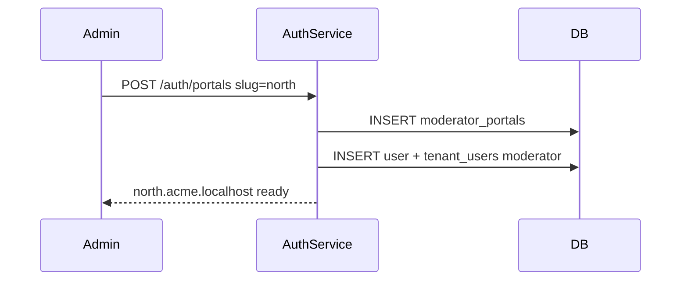

# Moderator portals — design

Admins create **nested subdomains** under their tenant and assign one **moderator** per portal. Each portal becomes `{slug}.{tenant}.BASE_DOMAIN`.

See also: [Roles & subdomains](../roles-and-subdomains/Design.md) · [Endpoints](./Endpoints.md)

---

## What it does

- **`POST /auth/portals`** — creates a `moderator_portals` row and a moderator user/membership with `portalId` set.
- **`GET /auth/portals`** — lists active portals for the tenant.

Only **admin** may call these endpoints, and only on the **tenant root host** (not on a portal subdomain).

---

## Lifecycle

After creation:

- Moderator logs in at `north.acme.localhost`.
- Moderator (or admin with cross-portal token) invites [cashiers and customers](../members/Design.md) on that portal host.

---

## Rules

- Portal `slug` unique per tenant; same format as `domainSlug`.
- If `moderatorEmail` is new, a user is created with `moderatorPassword`.
- If email exists globally but is not yet in this tenant, user is linked without requiring a new password.
- Duplicate slug or existing tenant membership → `409 Conflict`.

---

## Related code

| File | Role |
|------|------|
| `src/moderator-portal/` | Entity + service |
| `src/auth/auth.service.ts` | `createPortal()`, `listPortals()` |
| `src/auth/dto/auth.dto.ts` | `CreatePortalDto` |
