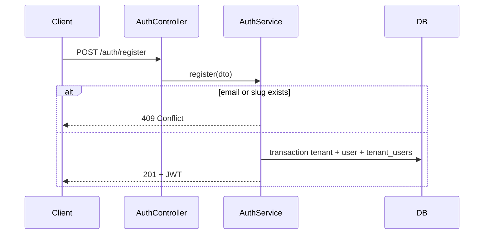

# Registration — design

Workspace signup: one request creates a **user**, a **tenant**, and links them as **admin**. The caller receives a JWT immediately.

See also: [Roles & subdomains](../roles-and-subdomains/Design.md) · [Endpoints](./Endpoints.md)

---

## What it does

- Creates a **user** with bcrypt-hashed password.
- Creates a **tenant** with a unique `domainSlug` (e.g. `acme` → `acme.localhost`).
- Creates a **tenant_users** row with `role: admin`, `portalId: null`.

All writes run in a **single transaction**.

---

## When to use

| Use case | Register? |
|----------|-----------|
| New company signing up | Yes |
| User joining existing workspace | No — use [Members](../members/Design.md) |
| Existing user creating another workspace | No — not implemented |

---

## Flow

---

## Security

- Passwords stored as bcrypt hashes only.
- JWT includes `sub`, `email`, `tenant_id`, `portal_id: null`, `role: admin`.
- Duplicate email or `domainSlug` rejected before the transaction.

---

## Related code

| File | Role |
|------|------|
| `src/auth/auth.controller.ts` | Route |
| `src/auth/auth.service.ts` | Orchestration |
| `src/auth/dto/register.dto.ts` | Validation |
