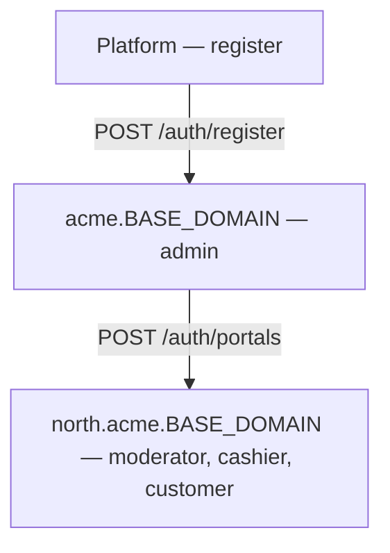
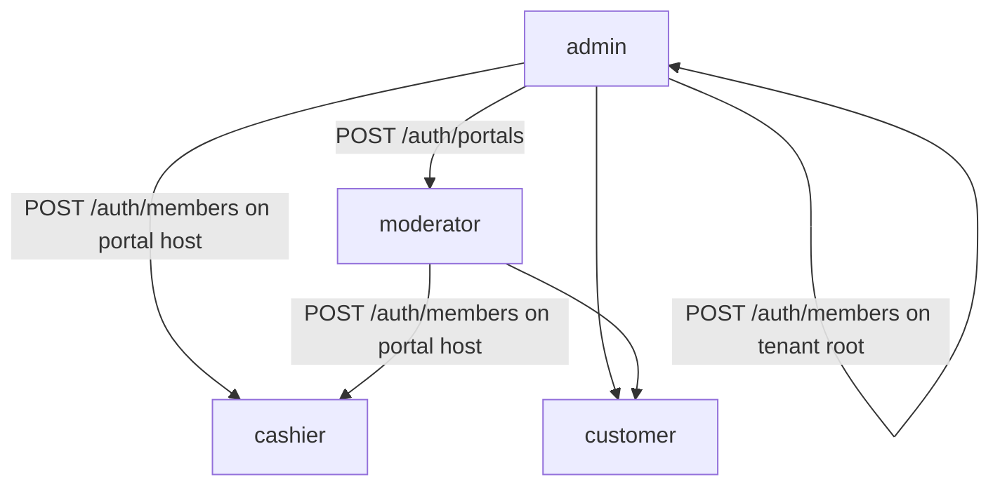

# Roles & hierarchical subdomains

Cross-cutting design for tenant roles, moderator portals, and host-based routing. See [Architecture.md](../../Architecture.md) for the overall multi-tenant model.

---

## What this covers

AuthApp uses **hierarchical subdomains** inside each tenant:

- **Admin** owns the tenant root (`acme.myapp.com`).
- **Admin** provisions **moderator portals** as nested subdomains (`north.acme.myapp.com`).
- **Moderator**, **cashier**, and **customer** operate on portal hosts; cashiers and customers always share the same portal URL.

---

## Roles

| Role | Value | Login host | `portalId` |
|------|-------|------------|------------|
| Admin | `admin` | `{tenant}.BASE_DOMAIN` | `null` |
| Moderator | `moderator` | `{portal}.{tenant}.BASE_DOMAIN` | required |
| Cashier | `cashier` | same as moderator portal | required |
| Customer | `customer` | same as moderator portal | required |

Enum: `src/common/enums/tenant-role.enum.ts`

---

## Subdomain hierarchy



| Host example (`BASE_DOMAIN=localhost`) | Resolved context |
|----------------------------------------|------------------|
| `localhost` | Platform — no tenant |
| `acme.localhost` | Tenant `acme`, no portal |
| `north.acme.localhost` | Tenant `acme`, portal `north` |
| `acme.com` (optional `customDomain`) | Tenant by custom domain |
| `north.acme.com` | Tenant + portal on custom domain |

Parser: `src/common/utils/tenant-host.util.ts`  
Middleware: `src/tenant/middleware/tenant-context.middleware.ts` sets `req.tenant` and `req.portal`.

---

## Assignment hierarchy



| Actor | Can assign |
|-------|------------|
| admin | admin, moderator (via portal creation), cashier, customer |
| moderator | cashier, customer |
| cashier / customer | none |

Helper: `canAssignRole()` in `src/common/utils/role.util.ts`

---

## JWT payload

Issued on register and login:

```json
{
  "sub": "user-uuid",
  "email": "user@example.com",
  "tenant_id": "tenant-uuid",
  "portal_id": "portal-uuid-or-null",
  "role": "admin"
}
```

- **Admin** tokens have `portal_id: null` but may call portal-host APIs on the same tenant (cross-portal admin access).
- **Portal-scoped** tokens must match the request `Host` portal.

---

## Guards

| Guard | Purpose |
|-------|---------|
| `RequireTenantGuard` | Host must resolve to a tenant |
| `RequirePortalGuard` | Host must resolve to a moderator portal |
| `TenantGuard` | Valid Bearer JWT; `tenant_id` and `portal_id` match host |
| `RolesGuard` | JWT role in `@Roles(...)` list |

Login additionally checks `isRoleAllowedOnHost()` — admin only on tenant root; moderator/cashier/customer only on portal hosts.

---

## Data model

### `moderator_portals`

| Column | Description |
|--------|-------------|
| `id` | UUID |
| `tenantId` | FK → tenants |
| `slug` | Portal subdomain segment (unique per tenant) |
| `status` | `active` / `suspended` |

### `tenant_users` (extended)

| Column | Description |
|--------|-------------|
| `role` | `admin` \| `moderator` \| `cashier` \| `customer` |
| `portalId` | FK → moderator_portals; `null` for admin |

### `tenants` (extended)

| Column | Description |
|--------|-------------|
| `customDomain` | Optional e.g. `acme.com` |

Migration: `src/database/migrations/1782065050601-AddTenantRolesAndPortals.ts`

---

## Related features

- [Registration](../register/Design.md) — creates tenant + admin
- [Login](../login/Design.md) — host-scoped authentication
- [Moderator portals](../moderator-portals/Design.md) — admin creates nested subdomains
- [Members](../members/Design.md) — invite users and change roles
